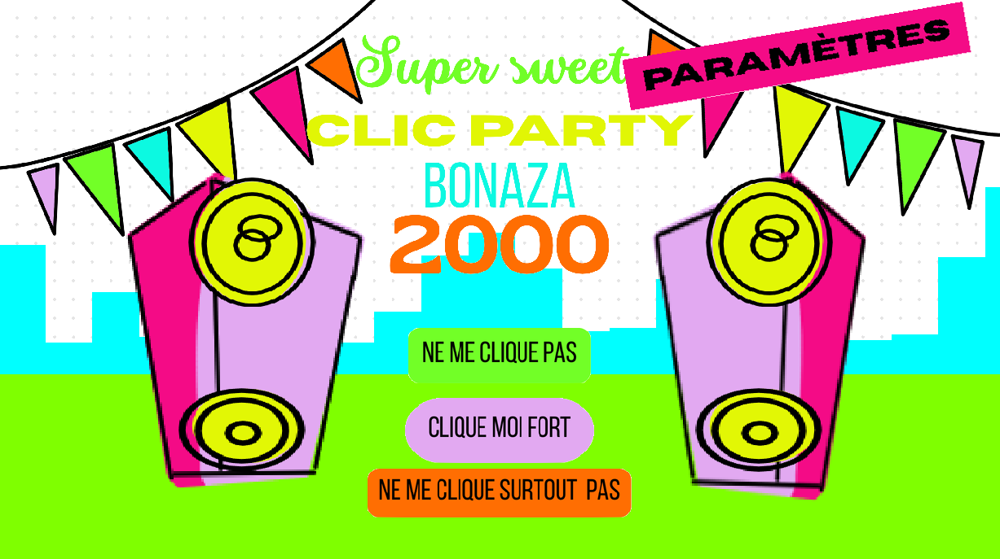

# Super Sweet Clic Party Bonaza 2000

> Réalisé en 30 heures dans le cadre de la **Code Game Jam 2026**, sur le thème **"Fête des clics"**.

---



## À propos du projet

**Super Sweet Clic Party Bonaza 2000** est un jeu de party game en rafale, librement inspiré du format WarioWare. Le joueur enchaîne des mini-jeux ultra-courts (5 à 15 secondes chacun), avec une consigne simple affichée en grand à chaque fois. Chaque victoire rapporte des **clics**, la monnaie centrale du jeu, tandis que chaque défaite coûte une **vie** (3 au total). Toutes les 5 parties, le joueur accède à un **shop** pour dépenser ses clics et acheter des améliorations ou bonus.

L'objectif : survivre le plus longtemps possible et cumuler un maximum de clics avant de perdre toutes ses vies.

---

## Contributeurs

- **Samuel Tittelein**
- **Antoine Jakubiak**
- **Théo Delaude**
- **Etienne Focquet**
- **Enzo Gomez Gonzalez**
- **Romain Lechêne**
- **Théo Mortreux**

---

## Lancer le projet

### Prérequis

Le jeu tourne sur **LÖVE2D v11.5**.  
- Installation : [https://love2d.org](https://love2d.org)
- Ou via Flatpak : `flatpak install flathub org.love2d.love2d`

### Lancement direct

```bash
love .
```

### Via le script (Flatpak)

```bash
./start.sh
```

### Build (toutes plateformes)

Nécessite [boon](https://github.com/camchenry/boon) (`cargo install boon`) :

```bash
./build.sh
```

Les exécutables générés sont disponibles dans le dossier `out/` pour Windows, Linux et macOS.

---

## Les mini-jeux

Le jeu propose **15 mini-jeux** différents, déclenchés aléatoirement et dont la difficulté augmente au fil des parties :

| Nom | Consigne | Description |
|---|---|---|
| **Taupe** | TAPE ! | Whack-a-Mole — cliquez sur les taupes qui sortent avant qu'elles ne disparaissent. |
| **Popup** | FERME ! | Fermez toutes les fenêtres popup avant la fin du temps imparti. |
| **Stocks** | INVESTIS ! | Observez la courbe boursière et cliquez au bon moment pour investir au plus bas ou vendre au plus haut. |
| **Taiko** | RYTHME ! | Mini-jeu de rythme style Taiko no Tatsujin — frappez les notes en rythme. |
| **Burger** | EMPILE ! | Assemblez les ingrédients d'un burger dans le bon ordre. |
| **Time Matcher** | SYNCHRONISE ! | Cliquez au moment précis indiqué par une horloge. |
| **Catch-Stick** | ATTRAPE ! | Attrapez un bâton en chute libre au bon moment. |
| **Wait** | ATTENDS ! | Ne cliquez surtout pas pendant 5 secondes — le défi du contrôle de soi. |
| **Runner Dash** | SAUTE ! | Sautez par-dessus les obstacles dans un runner 2D rétro. |
| **Find Different** | TROUVE ! | Trouvez l'intrus dans une grille d'objets similaires. |
| **Cute and Creepy** | TRIE ! | Glissez-déposez des images dans les catégories "mignon" ou "effrayant". |
| **Letterbox** | POSTE ! | Distribuez des lettres dans les boîtes aux lettres de la bonne couleur. |
| **Zombie Shooter** | SURVIE ! | Éliminez les zombies dans une vue FPS avant d'être submergé. |
| **Never Give Up** | MINE ! | Cliquez frénétiquement pour atteindre le quota de coups de pioche. |
| **Space Invader** | TIRE ! | Défendez-vous contre les envahisseurs de l'espace. |
